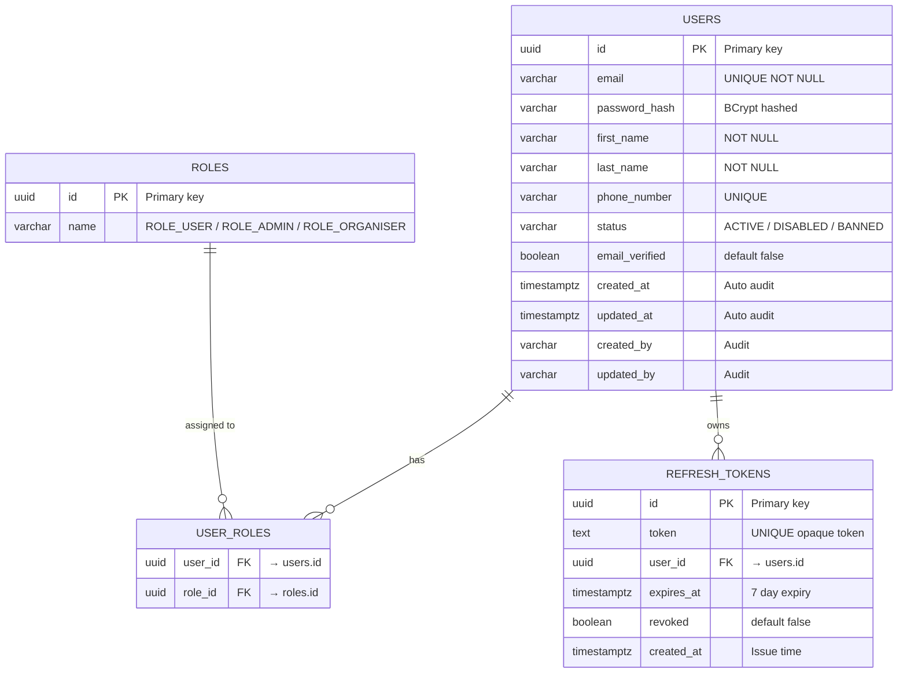
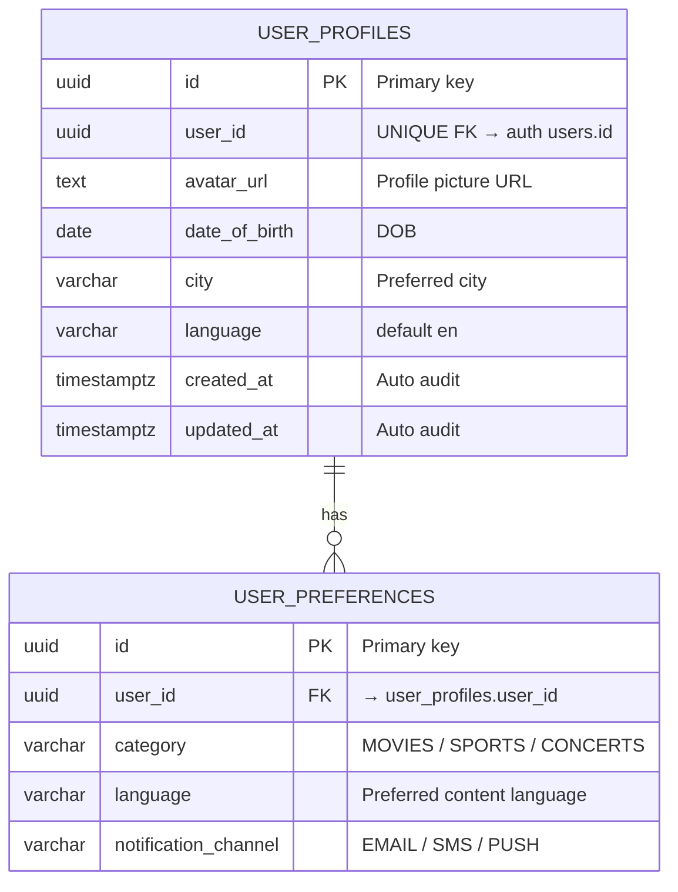
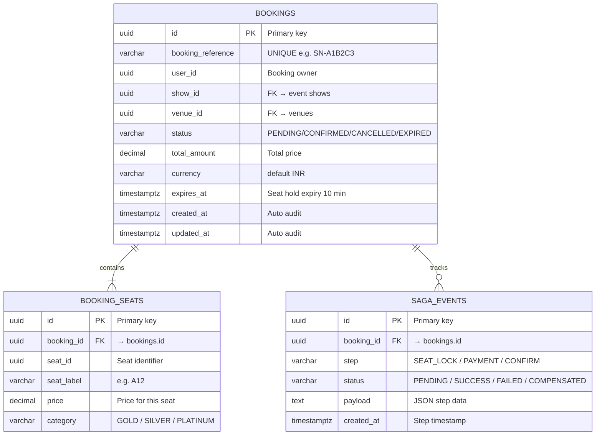
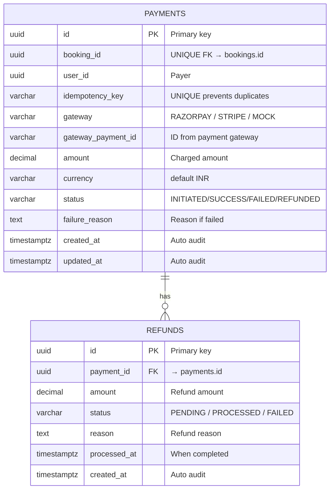
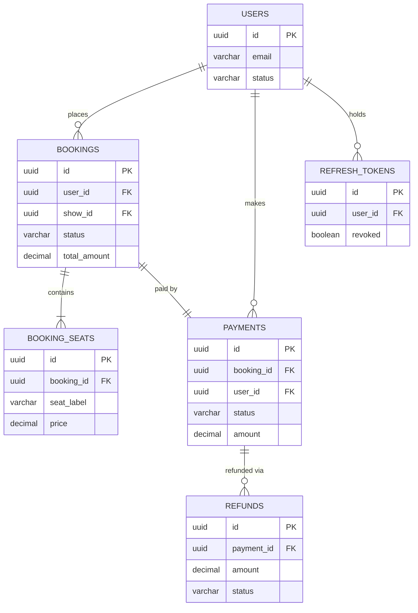

<div align="center">

# 🎬 ShowNest

### A Production-Ready Movie & Event Ticket Booking Platform

_Inspired by BookMyShow — Built with Microservices, Kafka, Kubernetes, and full Observability_

[](https://openjdk.org/)
[](https://spring.io/projects/spring-boot)
[](https://spring.io/projects/spring-cloud)
[](https://kafka.apache.org/)
[](https://kubernetes.io/)
[](https://www.postgresql.org/)

</div>

---

## 📋 Table of Contents

- [Overview](#overview)
- [Architecture](#architecture)
- [Services](#services)
- [Tech Stack](#tech-stack)
- [Database Schemas](#database-schemas)
- [API Reference](#api-reference)
- [Local Setup](#local-setup)
- [Deployment](#deployment)
- [Observability](#observability)
- [Project Structure](#project-structure)

---

## Overview

ShowNest was built as a full-scale, production-ready ticket booking system capable of handling millions of concurrent users. The platform supported browsing movies and live events, real-time seat selection with distributed locking, payment processing, and instant notifications — all delivered through a microservices architecture with complete observability.

### What was built

- Users browsed movies, concerts, and sports events filtered by city, date, and category
- Seats were locked in real-time for 10 minutes during checkout using Redis distributed locks
- Bookings were processed through a Saga-based distributed transaction spanning 4 services
- Payments were handled with idempotency keys to prevent duplicate charges
- Notifications were delivered via email and SMS through an async Kafka pipeline
- Full-text and geo-based search was powered by Elasticsearch
- Every request was traced end-to-end across services using Zipkin and correlation IDs
- The entire platform was containerized with Docker and deployed on Kubernetes with Helm

---

## Architecture

```
┌─────────────────────────────────────────────────────────────────┐
│                        Client (Web / Mobile)                    │
└──────────────────────────────┬──────────────────────────────────┘
                               │
┌──────────────────────────────▼──────────────────────────────────┐
│              API Gateway  (Spring Cloud Gateway · 8080)         │
│         JWT Validation · Rate Limiting · CORS · Routing         │
└──┬──────┬──────┬──────┬──────┬──────┬──────┬──────┬─────────────┘
   │      │      │      │      │      │      │      │
 Auth   User  Event  Venue  Seat  Booking Pay  Search
 8081  8082  8083   8084   8085   8086  8087   8089
   │      │      │      │      │      │      │      │
┌──▼──────▼──────▼──────▼──────▼──────▼──────▼──────▼────────────┐
│                    Service Registry (Eureka · 8761)            │
│                  Config Server (Spring Cloud · 8888)           │
└────────────────────────────────────────────────────────────────┘
                               │
        ┌──────────────────────▼──────────────────────┐
        │              Apache Kafka                   │
        │   booking-events · seat-events · pay-events │
        │          notification-events                │
        └──────────────────────┬──────────────────────┘
                               │
                    ┌──────────▼───────────┐
                    │  Notification Svc    │
                    │  (Email · SMS · Push)│
                    └──────────────────────┘
```

### Booking Flow (Saga Pattern)

```
User selects seats
      │
      ▼
[1] Seat Service     → Locks seats in Redis (10 min TTL)
      │
      ▼
[2] Booking Service  → Creates PENDING booking in PostgreSQL
      │
      ▼
[3] Payment Service  → Processes payment (Stripe/Razorpay)
      │
   ┌──┴──────────────────────┐
   │ SUCCESS                 │ FAILURE
   ▼                         ▼
[4a] Booking CONFIRMED    [4b] Booking CANCELLED
     Seat lock released         Seat lock released
     Ticket generated           Refund initiated
     Kafka → Notification       Kafka → Notification
```

---

## Services

| Service                    | Port | Responsibility                                      | Database           |
| -------------------------- | ---- | --------------------------------------------------- | ------------------ |
| **Config Server**          | 8888 | Centralized configuration for all services          | Filesystem / Git   |
| **Discovery Server**       | 8761 | Eureka service registry                             | In-memory          |
| **API Gateway**            | 8080 | Routing, JWT validation, rate limiting, CORS        | Redis              |
| **Auth Service**           | 8081 | Registration, login, JWT, refresh tokens, OAuth2    | PostgreSQL         |
| **User Service**           | 8082 | User profiles, preferences, booking history         | PostgreSQL         |
| **Event Service**          | 8083 | Movies, concerts, sports — CRUD + filtering         | MongoDB            |
| **Venue Service**          | 8084 | Theaters, stadiums, screens, seat layout maps       | MongoDB            |
| **Seat Service**           | 8085 | Real-time seat availability and distributed locking | Redis + PostgreSQL |
| **Booking Service**        | 8086 | Booking orchestrator — Saga coordinator             | PostgreSQL         |
| **Payment Service**        | 8087 | Payment processing, refunds, idempotency            | PostgreSQL         |
| **Notification Service**   | 8088 | Email, SMS, push via Kafka + RabbitMQ               | MongoDB            |
| **Search Service**         | 8089 | Full-text search, geo-search, faceted filters       | Elasticsearch      |
| **Recommendation Service** | 8090 | AI-based personalised event recommendations         | Redis + PostgreSQL |

---

## Tech Stack

<details>
<summary><b>Microservices & Platform</b></summary>

| Component          | Technology                 | Purpose                        |
| ------------------ | -------------------------- | ------------------------------ |
| Service Framework  | Spring Boot 3.5.16         | Core application framework     |
| Service Mesh       | Spring Cloud 2025.0.0      | Cloud-native patterns          |
| API Gateway        | Spring Cloud Gateway       | Reactive gateway, routing      |
| Config Management  | Spring Cloud Config Server | Centralised configuration      |
| Service Discovery  | Netflix Eureka             | Service registry and discovery |
| Inter-service REST | OpenFeign                  | Declarative HTTP clients       |
| Inter-service gRPC | gRPC + Protobuf            | High-performance binary RPC    |
| Load Balancing     | Spring Cloud LoadBalancer  | Client-side load balancing     |

</details>

<details>
<summary><b>Security</b></summary>

| Component         | Technology                            | Purpose                            |
| ----------------- | ------------------------------------- | ---------------------------------- |
| Authentication    | Spring Security + JWT (JJWT 0.12.x)   | Stateless auth                     |
| Authorization     | OAuth2 Resource Server                | Role-based access control          |
| Identity Provider | Keycloak                              | SSO, social login                  |
| Secrets           | HashiCorp Vault / AWS Secrets Manager | Secrets at rest                    |
| Compliance        | GDPR-aware data handling              | Right to erasure, data portability |

</details>

<details>
<summary><b>Polyglot Persistence</b></summary>

| Database            | Technology          | Used By                               |
| ------------------- | ------------------- | ------------------------------------- |
| Relational (ACID)   | PostgreSQL 16       | Auth, User, Booking, Payment          |
| Document store      | MongoDB Atlas       | Event, Venue, Notification            |
| Distributed cache   | Redis 7 Cluster     | Seat locking, sessions, rate limiting |
| Search engine       | Elasticsearch 8     | Search Service                        |
| Time-series / audit | Apache Cassandra    | Analytics, audit logs                 |
| Graph database      | Neo4j               | Social graph, recommendations         |
| Vector database     | Pinecone / Weaviate | AI recommendation embeddings          |

</details>

<details>
<summary><b>Messaging & Events</b></summary>

| Component       | Technology                | Purpose                                  |
| --------------- | ------------------------- | ---------------------------------------- |
| Event streaming | Apache Kafka 3.x          | Async events, seat events, notifications |
| Message queue   | RabbitMQ                  | Retry queues, dead-letter queues         |
| Event sourcing  | Kafka + CQRS pattern      | Audit trail, event replay                |
| Schema registry | Confluent Schema Registry | Avro schema evolution                    |

</details>

<details>
<summary><b>Observability</b></summary>

| Component           | Technology                                    | Purpose                            |
| ------------------- | --------------------------------------------- | ---------------------------------- |
| Distributed tracing | Zipkin + Jaeger                               | End-to-end request tracing         |
| Metrics             | Prometheus + Micrometer                       | JVM, HTTP, custom business metrics |
| Dashboards          | Grafana                                       | Real-time visualisation            |
| Centralised logging | ELK Stack (Elasticsearch + Logstash + Kibana) | Log aggregation                    |
| Correlation         | MDC + Correlation IDs                         | Trace requests across services     |

</details>

<details>
<summary><b>Deployment & Infrastructure</b></summary>

| Component              | Technology                       | Purpose                       |
| ---------------------- | -------------------------------- | ----------------------------- |
| Containerisation       | Docker + multi-stage builds      | Reproducible builds           |
| Orchestration          | Kubernetes + Helm charts         | Auto-scaling, rolling updates |
| CI/CD                  | GitHub Actions                   | Build → Test → Push → Deploy  |
| Infrastructure as Code | Terraform                        | Cloud resource provisioning   |
| Cloud                  | AWS (EKS, RDS, ElastiCache, MSK) | Managed cloud services        |

</details>

---

## Database Schemas

---

### Auth Service — PostgreSQL



<details>
<summary>Column Reference</summary>

#### `users`

| Column           | Type           | Constraints                | Description                |
| ---------------- | -------------- | -------------------------- | -------------------------- |
| `id`             | `UUID`         | PK                         | Primary key                |
| `email`          | `VARCHAR(255)` | UNIQUE, NOT NULL           | User email                 |
| `password_hash`  | `VARCHAR(255)` | NOT NULL                   | BCrypt hashed password     |
| `first_name`     | `VARCHAR(100)` | NOT NULL                   | First name                 |
| `last_name`      | `VARCHAR(100)` | NOT NULL                   | Last name                  |
| `phone_number`   | `VARCHAR(20)`  | UNIQUE                     | Mobile number              |
| `status`         | `VARCHAR(20)`  | NOT NULL, default `ACTIVE` | ACTIVE / DISABLED / BANNED |
| `email_verified` | `BOOLEAN`      | default `false`            | Email verification flag    |
| `created_at`     | `TIMESTAMPTZ`  | NOT NULL                   | Auto-set on insert         |
| `updated_at`     | `TIMESTAMPTZ`  | NOT NULL                   | Auto-set on update         |
| `created_by`     | `VARCHAR(255)` |                            | Audit — who created        |
| `updated_by`     | `VARCHAR(255)` |                            | Audit — who last updated   |

#### `roles`

| Column | Type          | Constraints      | Description                             |
| ------ | ------------- | ---------------- | --------------------------------------- |
| `id`   | `UUID`        | PK               | Primary key                             |
| `name` | `VARCHAR(50)` | UNIQUE, NOT NULL | ROLE_USER / ROLE_ADMIN / ROLE_ORGANISER |

#### `user_roles` _(join table)_

| Column    | Type   | Constraints   | Description    |
| --------- | ------ | ------------- | -------------- |
| `user_id` | `UUID` | FK → users.id | User reference |
| `role_id` | `UUID` | FK → roles.id | Role reference |

#### `refresh_tokens`

| Column       | Type          | Constraints      | Description          |
| ------------ | ------------- | ---------------- | -------------------- |
| `id`         | `UUID`        | PK               | Primary key          |
| `token`      | `TEXT`        | UNIQUE, NOT NULL | Opaque refresh token |
| `user_id`    | `UUID`        | FK → users.id    | Token owner          |
| `expires_at` | `TIMESTAMPTZ` | NOT NULL         | Expiry (7 days)      |
| `revoked`    | `BOOLEAN`     | default `false`  | Revoked flag         |
| `created_at` | `TIMESTAMPTZ` | NOT NULL         | Issue time           |

</details>

---

### User Service — PostgreSQL



<details>
<summary>Column Reference</summary>

#### `user_profiles`

| Column          | Type           | Constraints      | Description         |
| --------------- | -------------- | ---------------- | ------------------- |
| `id`            | `UUID`         | PK               | Primary key         |
| `user_id`       | `UUID`         | UNIQUE, NOT NULL | FK → auth users.id  |
| `avatar_url`    | `TEXT`         |                  | Profile picture URL |
| `date_of_birth` | `DATE`         |                  | Date of birth       |
| `city`          | `VARCHAR(100)` |                  | Preferred city      |
| `language`      | `VARCHAR(10)`  | default `en`     | Preferred language  |
| `created_at`    | `TIMESTAMPTZ`  | NOT NULL         |                     |
| `updated_at`    | `TIMESTAMPTZ`  | NOT NULL         |                     |

</details>

---

### Booking Service — PostgreSQL



<details>
<summary>Column Reference</summary>

#### `bookings`

| Column              | Type            | Constraints      | Description                               |
| ------------------- | --------------- | ---------------- | ----------------------------------------- |
| `id`                | `UUID`          | PK               | Primary key                               |
| `booking_reference` | `VARCHAR(12)`   | UNIQUE, NOT NULL | e.g. `SN-A1B2C3`                          |
| `user_id`           | `UUID`          | NOT NULL         | Booking owner                             |
| `show_id`           | `UUID`          | NOT NULL         | FK → event shows                          |
| `venue_id`          | `UUID`          | NOT NULL         | FK → venues                               |
| `status`            | `VARCHAR(20)`   | NOT NULL         | PENDING / CONFIRMED / CANCELLED / EXPIRED |
| `total_amount`      | `DECIMAL(10,2)` | NOT NULL         | Total price                               |
| `currency`          | `VARCHAR(3)`    | default `INR`    | Currency code                             |
| `expires_at`        | `TIMESTAMPTZ`   |                  | Seat hold expiry (10 min)                 |
| `created_at`        | `TIMESTAMPTZ`   | NOT NULL         |                                           |
| `updated_at`        | `TIMESTAMPTZ`   | NOT NULL         |                                           |

#### `booking_seats`

| Column       | Type            | Constraints      | Description              |
| ------------ | --------------- | ---------------- | ------------------------ |
| `id`         | `UUID`          | PK               | Primary key              |
| `booking_id` | `UUID`          | FK → bookings.id | Parent booking           |
| `seat_id`    | `UUID`          | NOT NULL         | Seat identifier          |
| `seat_label` | `VARCHAR(10)`   | NOT NULL         | e.g. `A12`               |
| `price`      | `DECIMAL(10,2)` | NOT NULL         | Price for this seat      |
| `category`   | `VARCHAR(20)`   | NOT NULL         | GOLD / SILVER / PLATINUM |

#### `saga_events` _(distributed transaction log)_

| Column       | Type          | Constraints      | Description                              |
| ------------ | ------------- | ---------------- | ---------------------------------------- |
| `id`         | `UUID`        | PK               | Primary key                              |
| `booking_id` | `UUID`        | FK → bookings.id | Parent booking                           |
| `step`       | `VARCHAR(50)` | NOT NULL         | SEAT_LOCK / PAYMENT / CONFIRM            |
| `status`     | `VARCHAR(20)` | NOT NULL         | PENDING / SUCCESS / FAILED / COMPENSATED |
| `payload`    | `TEXT`        |                  | JSON step data for replay                |
| `created_at` | `TIMESTAMPTZ` | NOT NULL         | Step timestamp                           |

</details>

---

### Payment Service — PostgreSQL



<details>
<summary>Column Reference</summary>

#### `payments`

| Column               | Type            | Constraints      | Description                             |
| -------------------- | --------------- | ---------------- | --------------------------------------- |
| `id`                 | `UUID`          | PK               | Primary key                             |
| `booking_id`         | `UUID`          | UNIQUE, NOT NULL | FK → bookings.id                        |
| `user_id`            | `UUID`          | NOT NULL         | Payer                                   |
| `idempotency_key`    | `VARCHAR(255)`  | UNIQUE, NOT NULL | Prevents duplicate charges              |
| `gateway`            | `VARCHAR(50)`   | NOT NULL         | RAZORPAY / STRIPE / MOCK                |
| `gateway_payment_id` | `VARCHAR(255)`  |                  | Payment ID from gateway                 |
| `amount`             | `DECIMAL(10,2)` | NOT NULL         | Charged amount                          |
| `currency`           | `VARCHAR(3)`    | default `INR`    | Currency                                |
| `status`             | `VARCHAR(20)`   | NOT NULL         | INITIATED / SUCCESS / FAILED / REFUNDED |
| `failure_reason`     | `TEXT`          |                  | Reason if failed                        |
| `created_at`         | `TIMESTAMPTZ`   | NOT NULL         |                                         |
| `updated_at`         | `TIMESTAMPTZ`   | NOT NULL         |                                         |

#### `refunds`

| Column         | Type            | Constraints      | Description                  |
| -------------- | --------------- | ---------------- | ---------------------------- |
| `id`           | `UUID`          | PK               | Primary key                  |
| `payment_id`   | `UUID`          | FK → payments.id | Original payment             |
| `amount`       | `DECIMAL(10,2)` | NOT NULL         | Refund amount                |
| `status`       | `VARCHAR(20)`   | NOT NULL         | PENDING / PROCESSED / FAILED |
| `reason`       | `TEXT`          |                  | Refund reason                |
| `processed_at` | `TIMESTAMPTZ`   |                  | When refund completed        |
| `created_at`   | `TIMESTAMPTZ`   | NOT NULL         |                              |

</details>

---

### Full Cross-Service Entity Relationship



---

## API Reference

<details>
<summary><b>Auth Service — /api/v1/auth</b></summary>

| Method | Endpoint           | Auth   | Description                                 |
| ------ | ------------------ | ------ | ------------------------------------------- |
| `POST` | `/register`        | Public | Create a new account                        |
| `POST` | `/login`           | Public | Login, returns access + refresh tokens      |
| `POST` | `/refresh`         | Public | Exchange refresh token for new access token |
| `POST` | `/logout`          | Bearer | Revoke refresh token                        |
| `GET`  | `/me`              | Bearer | Get current user info                       |
| `POST` | `/verify-email`    | Public | Verify email with token                     |
| `POST` | `/forgot-password` | Public | Send password reset email                   |
| `POST` | `/reset-password`  | Public | Reset password with token                   |

</details>

<details>
<summary><b>Event Service — /api/v1/events</b></summary>

| Method   | Endpoint      | Auth   | Description                                  |
| -------- | ------------- | ------ | -------------------------------------------- |
| `GET`    | `/`           | Public | List events (filter by city, date, category) |
| `GET`    | `/{id}`       | Public | Get event details                            |
| `GET`    | `/{id}/shows` | Public | Get all shows for an event                   |
| `POST`   | `/`           | ADMIN  | Create event                                 |
| `PUT`    | `/{id}`       | ADMIN  | Update event                                 |
| `DELETE` | `/{id}`       | ADMIN  | Cancel event                                 |

</details>

<details>
<summary><b>Seat Service — /api/v1/seats</b></summary>

| Method   | Endpoint         | Auth   | Description                      |
| -------- | ---------------- | ------ | -------------------------------- |
| `GET`    | `/show/{showId}` | Public | Get seat availability for a show |
| `POST`   | `/lock`          | Bearer | Lock selected seats (10 min TTL) |
| `DELETE` | `/lock/{lockId}` | Bearer | Release seat lock                |

</details>

<details>
<summary><b>Booking Service — /api/v1/bookings</b></summary>

| Method   | Endpoint | Auth   | Description                    |
| -------- | -------- | ------ | ------------------------------ |
| `POST`   | `/`      | Bearer | Create booking (triggers Saga) |
| `GET`    | `/{id}`  | Bearer | Get booking details            |
| `GET`    | `/my`    | Bearer | Get current user's bookings    |
| `DELETE` | `/{id}`  | Bearer | Cancel booking                 |

</details>

<details>
<summary><b>Search Service — /api/v1/search</b></summary>

| Method | Endpoint       | Auth   | Description                     |
| ------ | -------------- | ------ | ------------------------------- |
| `GET`  | `/events`      | Public | Full-text search events         |
| `GET`  | `/events/near` | Public | Geo-search events near location |
| `GET`  | `/suggestions` | Public | Autocomplete suggestions        |

</details>

---

## Local Setup

### Prerequisites

Make sure these are installed:

| Tool           | Version  | Download                                      |
| -------------- | -------- | --------------------------------------------- |
| Java           | 21 (LTS) | [adoptium.net](https://adoptium.net/)         |
| Maven          | 3.9+     | [maven.apache.org](https://maven.apache.org/) |
| Docker Desktop | Latest   | [docker.com](https://www.docker.com/)         |
| Git            | Latest   | [git-scm.com](https://git-scm.com/)           |

---

### Step 1 — Clone the Repository

```bash
git clone https://github.com/addymistrel/ShowNest.git
cd ShowNest
```

---

### Step 2 — Start Infrastructure (Docker)

This starts PostgreSQL, Redis, MongoDB, Kafka, and Zookeeper locally:

```bash
docker-compose -f backend/docker-compose.dev.yml up -d
```

Verify containers are running:

```bash
docker ps
```

You should see:

```
shownest-postgres   → localhost:5432
shownest-redis      → localhost:6379
shownest-mongo      → localhost:27017
shownest-kafka      → localhost:9092
shownest-zookeeper  → localhost:2181
```

---

### Step 3 — Build the Project

```bash
cd backend
mvn clean install -DskipTests
```

---

### Step 4 — Start Services (in order)

Open a terminal for each service and start them **in this exact order**:

```bash
# 1. Config Server (must be first)
cd backend/platform/config-server
mvn spring-boot:run

# 2. Discovery Server (wait for Config Server to be UP)
cd backend/platform/discovery-server
mvn spring-boot:run

# 3. API Gateway
cd backend/platform/api-gateway
mvn spring-boot:run

# 4. Auth Service
cd backend/services/auth-service
mvn spring-boot:run
```

---

### Step 5 — Verify Everything is Running

| Service          | URL                                   | Expected                  |
| ---------------- | ------------------------------------- | ------------------------- |
| Config Server    | http://localhost:8888/actuator/health | `{"status":"UP"}`         |
| Eureka Dashboard | http://localhost:8761                 | Shows registered services |
| API Gateway      | http://localhost:8080/actuator/health | `{"status":"UP"}`         |
| Auth Service     | http://localhost:8081/actuator/health | `{"status":"UP"}`         |

---

### Step 6 — Test the Auth API

Register a user:

```bash
curl -X POST http://localhost:8080/api/v1/auth/register \
  -H "Content-Type: application/json" \
  -d '{
    "firstName": "John",
    "lastName": "Doe",
    "email": "john@example.com",
    "password": "SecurePass@123"
  }'
```

Login:

```bash
curl -X POST http://localhost:8080/api/v1/auth/login \
  -H "Content-Type: application/json" \
  -d '{
    "email": "john@example.com",
    "password": "SecurePass@123"
  }'
```

---

### Environment Variables

Create a `.env` file in the project root (never commit this):

```env
# Database
DB_USERNAME=shownest
DB_PASSWORD=shownest123

# JWT
JWT_SECRET=your-very-long-256-bit-secret-key-replace-this-in-production

# Redis
REDIS_HOST=localhost
REDIS_PORT=6379

# MongoDB
MONGO_URI=mongodb://localhost:27017/shownest
```

---

## Deployment

### Docker Compose (full stack)

```bash
docker-compose -f backend/docker-compose.yml up -d
```

### Kubernetes + Helm

```bash
# Install all services
helm install shownest ./infrastructure/kubernetes/helm/shownest \
  --namespace shownest \
  --create-namespace \
  --values ./infrastructure/kubernetes/helm/shownest/values.prod.yaml
```

### CI/CD

Every push to `main` triggers the GitHub Actions pipeline:

1. **Build** — `mvn clean install`
2. **Test** — unit + integration tests
3. **Docker Build** — multi-stage build per service
4. **Push** — Docker images to GitHub Container Registry
5. **Deploy** — `helm upgrade` to Kubernetes cluster

---

## Observability

| Dashboard        | URL (local)           | Credentials   |
| ---------------- | --------------------- | ------------- |
| Eureka Dashboard | http://localhost:8761 | None          |
| Grafana          | http://localhost:3000 | admin / admin |
| Kibana (logs)    | http://localhost:5601 | None          |
| Zipkin (traces)  | http://localhost:9411 | None          |
| Prometheus       | http://localhost:9090 | None          |

---

## Project Structure

```
ShowNest/
├── backend/
│   ├── pom.xml                          # Root POM — version management
│   ├── docker-compose.dev.yml           # Local infrastructure
│   ├── platform/
│   │   ├── config-server/               # Centralised config (port 8888)
│   │   ├── discovery-server/            # Eureka registry (port 8761)
│   │   └── api-gateway/                 # Spring Cloud Gateway (port 8080)
│   ├── services/
│   │   ├── auth-service/                # JWT auth (port 8081)
│   │   ├── user-service/                # Profiles (port 8082)
│   │   ├── event-service/               # Events (port 8083)
│   │   ├── venue-service/               # Venues (port 8084)
│   │   ├── seat-service/                # Seat locking (port 8085)
│   │   ├── booking-service/             # Saga orchestrator (port 8086)
│   │   ├── payment-service/             # Payments (port 8087)
│   │   ├── notification-service/        # Notifications (port 8088)
│   │   ├── search-service/              # Elasticsearch (port 8089)
│   │   └── recommendation-service/      # AI recs (port 8090)
│   ├── shared/
│   │   └── common-core/                 # Shared DTOs, exceptions, audit
│   └── contracts/
│       ├── openapi/                     # API specs
│       ├── grpc/                        # Protobuf definitions
│       └── kafka-schema/                # Avro schemas
├── infrastructure/
│   ├── docker/                          # Dockerfiles
│   ├── kubernetes/                      # K8s manifests + Helm charts
│   ├── terraform/                       # IaC — AWS provisioning
│   ├── monitoring/                      # Prometheus + Grafana config
│   └── scripts/                         # Utility scripts
├── docs/
│   ├── architecture/                    # Architecture decisions + concepts
│   ├── api/                             # API documentation
│   └── database/                        # Schema diagrams
└── frontend/                            # React/Next.js (coming soon)
```

---

<div align="center">

Built with ❤️ as a production-grade learning project

</div>
